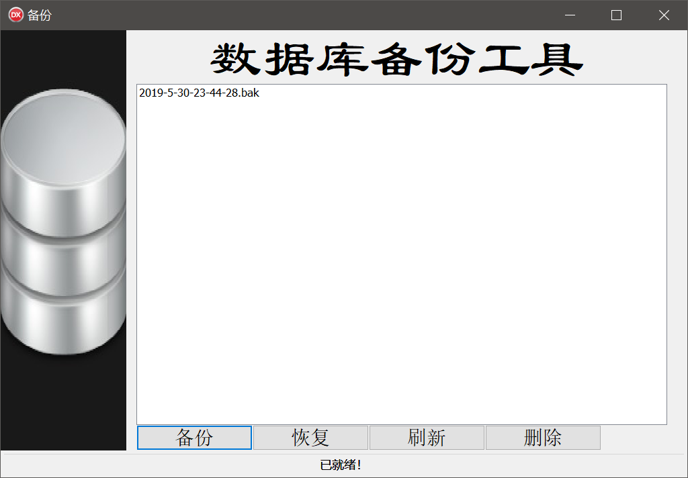

# 1. 2018～2019学年第2学期Delphi数据库课程设计

## 1.1. 目录

- [1. 2018～2019学年第2学期Delphi数据库课程设计](#1-20182019%E5%AD%A6%E5%B9%B4%E7%AC%AC2%E5%AD%A6%E6%9C%9Fdelphi%E6%95%B0%E6%8D%AE%E5%BA%93%E8%AF%BE%E7%A8%8B%E8%AE%BE%E8%AE%A1)
  - [1.1. 目录](#11-%E7%9B%AE%E5%BD%95)
  - [1.2. 系统需求](#12-%E7%B3%BB%E7%BB%9F%E9%9C%80%E6%B1%82)
    - [1.2.1. 系统功能简介](#121-%E7%B3%BB%E7%BB%9F%E5%8A%9F%E8%83%BD%E7%AE%80%E4%BB%8B)
    - [1.2.2. 软件环境与开发工具](#122-%E8%BD%AF%E4%BB%B6%E7%8E%AF%E5%A2%83%E4%B8%8E%E5%BC%80%E5%8F%91%E5%B7%A5%E5%85%B7)
  - [1.3. 数据库设计](#13-%E6%95%B0%E6%8D%AE%E5%BA%93%E8%AE%BE%E8%AE%A1)
    - [1.3.1. 概要结构设计](#131-%E6%A6%82%E8%A6%81%E7%BB%93%E6%9E%84%E8%AE%BE%E8%AE%A1)
      - [1.3.1.1. 数据表结构分析](#1311-%E6%95%B0%E6%8D%AE%E8%A1%A8%E7%BB%93%E6%9E%84%E5%88%86%E6%9E%90)
  - [1.4. 系统设计与实现](#14-%E7%B3%BB%E7%BB%9F%E8%AE%BE%E8%AE%A1%E4%B8%8E%E5%AE%9E%E7%8E%B0)
  - [1.5. 结论与尚存在的问题](#15-%E7%BB%93%E8%AE%BA%E4%B8%8E%E5%B0%9A%E5%AD%98%E5%9C%A8%E7%9A%84%E9%97%AE%E9%A2%98)
  - [1.6. 个人总结](#16-%E4%B8%AA%E4%BA%BA%E6%80%BB%E7%BB%93)
  - [1.7. 项目用法](#17-%E9%A1%B9%E7%9B%AE%E7%94%A8%E6%B3%95)

## 1.2. 系统需求

### 1.2.1. 系统功能简介

&emsp;&emsp;本项目是一个户籍管理系统，用于记录住户身份信息，提供新户登记（增加）、户籍变更（修改）、户籍注销（删除）、户籍查询、曾用名查询、迁户记录查询以及创建备份、删除备份共8个功能。

### 1.2.2. 软件环境与开发工具

- 操作系统：Windows 10 Home China 1809 17763
- 数据库：[SQL Server Express 2017](https://www.microsoft.com/zh-cn/sql-server/sql-server-downloads)
- 集成开发环境：[Embarcadero Delphi Architect 10.3](https://www.embarcadero.com/cn/products/delphi)

## 1.3. 数据库设计

### 1.3.1. 概要结构设计

&emsp;&emsp;数据库`Manager`共包括以下3张表：

| 表名         | 说明                                     |
| ------------ | ---------------------------------------- |
| `People`     | 存储用户信息，是程序的核心表             |
| `Rename`     | 存储用户改名记录，作为曾用名表           |
| `Move`       | 存储用户的住址变更记录，作为户籍变更历史 |
| `Controller` | 存储系统管理员账户信息                   |

#### 1.3.1.1. 数据表结构分析

&emsp;&emsp;4张数据表的字段分别列举如下：

| 字段名    | 含义             | 类型             |
| --------- | ---------------- | ---------------- |
| `Name`    | 姓名             | `NVARCHAR(10)`   |
| `Sex`     | 性别             | `NCHAR(2)`       |
| `ID_Num`  | 身份证号（主键） | `CHAR(18)`       |
| `Address` | 户籍地址         | `NVARCHAR(100)`  |
| `Tel_No`  | 联系方式         | `NUMERIC(12, 0)` |
| `Date`    | 更新时间         | `DATETIME`       |

 

| 字段名     | 含义                 | 类型       |
| ---------- | -------------------- | ---------- |
| `ID_Num`   | 身份证号（主键）     | `CHAR(18)` |
| `Old_Name` | 曾用名               | `CHAR(10)` |
| `Date`     | 改名时间（升序索引） | `DATETIME` |

 

| 字段名    | 含义                 | 类型            |
| --------- | -------------------- | --------------- |
| `ID_Num`  | 身份证号（主键）     | `CHAR(18)`      |
| `Address` | 曾用户籍地           | `NVARCHAR(100)` |
| `Date`    | 迁户时间（升序索引） | `DATETIME`      |

 

| 字段名     | 含义           | 类型             |
| ---------- | -------------- | ---------------- |
| `Username` | 用户名（主键） | `NCHAR(10)`      |
| `Alias`    | 别名           | `NCHAR(10)`      |
| `Password` | 密码           | `VARBINARY(128)` |

 

## 1.4. 系统设计与实现

## 1.5. 结论与尚存在的问题

&emsp;&emsp;以下是本项目仍然存在的问题：

1. 用户查询功能存在缺陷，无法在`DBGrid`中显示`ADOQuery`的查询结果；
2. 数据库无法从`*.bak`文件中恢复。

## 1.6. 个人总结

&emsp;&emsp;项目由可视化集成开发环境（快速应用程序开发工具）制作而成，对比于C/C++ MFC/QT、Java Swing/SWT、Python TKinter，Delphi具有方便、快捷的优势，在界面布局方面节省了大量的时间。但在另一方面，仍有个别功能只能通过编写代码实现，大量由Delphi自动生成的Object-Pascal代码使得项目维护难度提高。

&emsp;&emsp;本次开发工作存在较大的失误，项目分工错误让我基本承担所有工作。此外项目的开工时间极度延后，导致工期不足，甚至无法完成基本功能。

&emsp;&emsp;通过此次开发的教训，在后续课程设计乃至今后的生产环境开发都要提前估计工作量与工期，合理安排开发进度，杜绝临时赶工的行为。

## 1.7. 项目用法

&emsp;&emsp;由于项目需要连接数据库程序，而不同设备的数据库配置可能存在差异，有别于直接连接到库文件的[Microsoft Office Access](https://products.office.com/zh-cn/access)、[SQLite](https://sqlite.org/index.html)。由我使用Windows-32bit Release模式编译发布的可执行程序并不通用，所以请根据以下步骤编译运行：

1. 项目提供了[`Citizens_log.ldf`](db/Citizens_log.ldf)数据库日志文件和[`Citizens.mdf`](db/Citizens.mdf)数据库主文件，这2个文件仅支持Microsoft SQL Server 2017及以上版本数据库的附加。对于之前的版本，项目额外提供了[`script.sql`](db/script.sql)以实现数据库导入工作，此脚本最低兼容SQL Server 2008。脚本仅涉及架构，没有任何数据。如有测试需要，请在运行此脚本生成数据库后自行添加备用数据。

2. 使用Delphi打开代码库中的[`Manager.dproj`](src/Manager.dproj)，定位至[`Connect.pas`](src/Connect.pas)文件的窗体设计视图。

3. 修改`ADOConnection1`控件的`ConnectionString`属性，点击`Build`选项，在数据库连接向导切换为您设备的配置（包括驱动程序、服务器名、登陆账号及密码、数据库名）。

4. 定位至[`Backup.pas`](src/Backup.pas)文件的窗体设计视图，同样地修改`ADOQuery1`控件的`ConnectionString`属性。

5. 定位至[`Edit.pas`](src/Edit.pas)、[`Move.pas`](src/Move.pas)、[`Rename.pas`](src/Rename.pas)，重新激活各个页面的`ADOTable1`，确认`DBGrid`能够正常显示数据库的内容。

6. 以上，即可正常编译运行。
